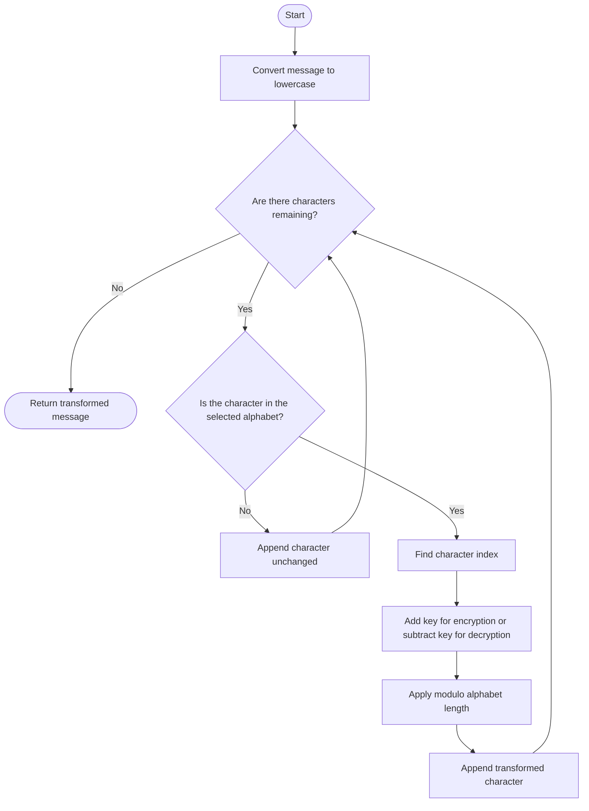

# Caesar Cipher Algorithm

The encryption and decryption functions process the message one character at a time. Supported characters are shifted within the selected alphabet, while spaces, numbers, punctuation, and other unsupported characters are preserved.

For an alphabet of length `N`, the transformed index is calculated as follows:

- Encryption: `(index + key) % N`
- Decryption: `(index - key) % N`

This modular operation makes the shift circular. For example, shifting the last character of an alphabet moves back to its first character.
