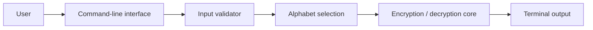

# Application Architecture

CaesarCipherScript is a small command-line application. Its responsibilities are separated into an orchestration layer, input validation, alphabet definitions, and the encryption/decryption core.

## Components

| Component | Responsibility | Source |
| --- | --- | --- |
| Command-line interface | Presents menus, receives the message and coordinates the operation | [`script.py`](../script.py) |
| Input validator | Validates menu options, integer input, and positive keys | [`Utils/invalid_type.py`](../Utils/invalid_type.py) |
| Alphabet selection | Provides English and Spanish alphabets and their reverse mappings | [`Utils/alphabet.py`](../Utils/alphabet.py) |
| Encryption core | Applies a positive modular shift to each supported character | [`Core/encryption.py`](../Core/encryption.py) |
| Decryption core | Applies the inverse modular shift to each supported character | [`Core/decryption.py`](../Core/decryption.py) |
| Terminal output | Displays the encrypted or decrypted result to the user | [`script.py`](../script.py) |

The application does not use a database, network service, or external dependency. Its input and output are handled through the terminal.
