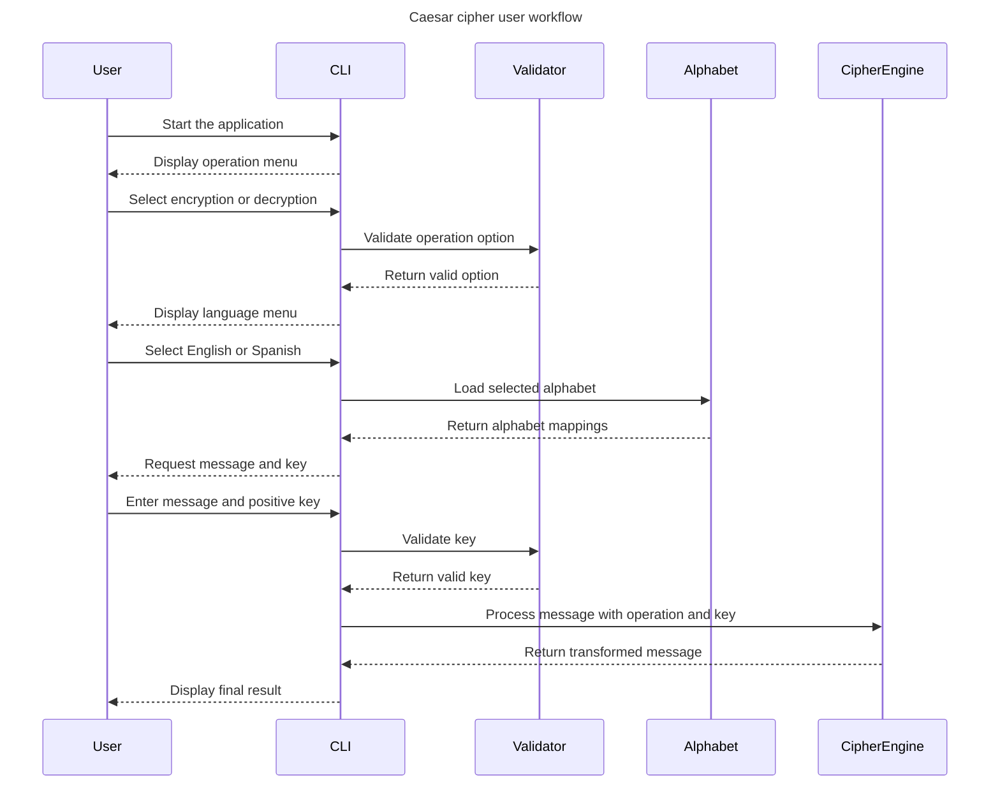

# User Workflow Sequence

The following sequence shows the successful path for both encryption and decryption. The selected operation determines which core function receives the message.

The decryption workflow uses the same interaction sequence, but applies the inverse shift to recover the original message.
