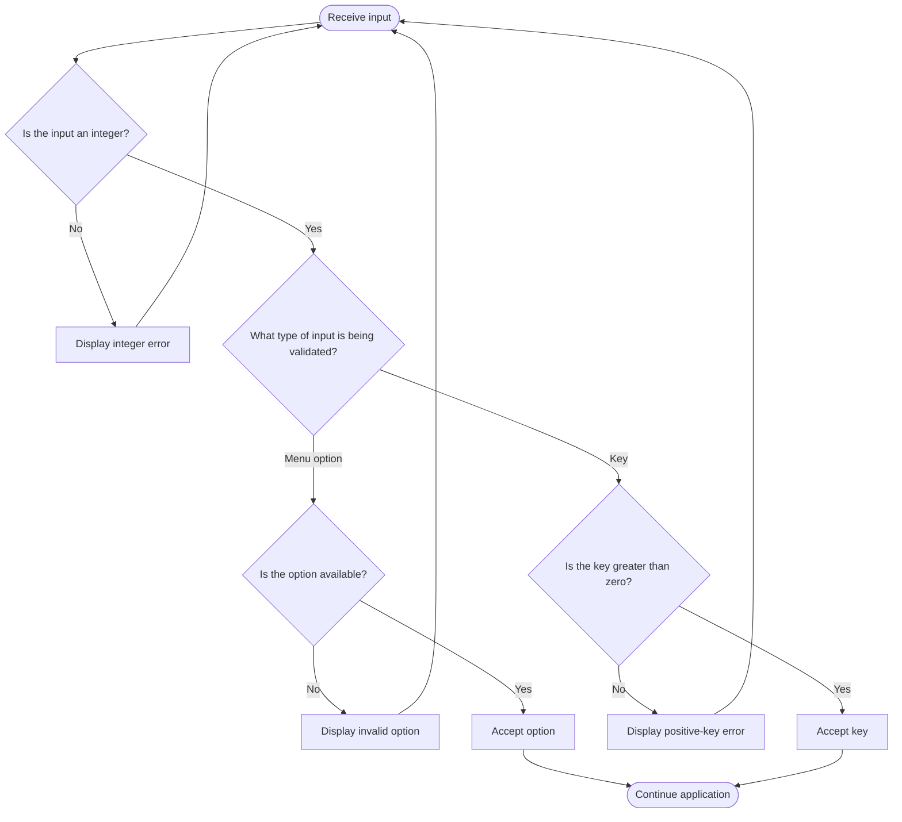

# Input Validation Flow

The application validates menu options and numeric input before performing an operation. Invalid input is rejected and the corresponding prompt is shown again.

The key validation is strict: `0` and negative integers are rejected. Positive keys greater than the alphabet length are accepted and normalized by the modulo operation inside the cipher core.
